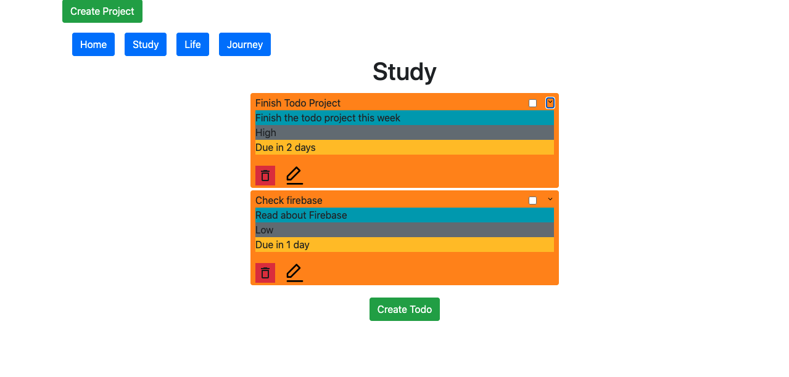

# Todo List

> This is a multi project todo-list,Create projects and create todos, all stored in localStorage.


## Screenshot


## Live Demo
- TBA

## Built With
- JavaScript
- HTML 5 and CSS 3.
- Bootstrap


## Getting Started

- Clone the repository using ```git clone git@github.com:iam-Akshat/todolist-js.git```
- cd into the cloned repository with ```cd todolist-js```
- Run ```npm i```
- Run ```npm run watch```
- Open the index.html file in the 'dist' folder.

## Testing
- App uses jest for testing, it should already be installed using `npm i` from getting    started section.
- run `npm test` to start running tests.
## Authors

👤 **Akshat Sethi**

- Github: [iam-Akshat](https://github.com/iam-Akshat)
- Twitter: [Akshat Sethi](https://twitter.com/akshatsethi)
- LinkedIn: [Akshat Sethi](https://linkedin.com/in/akshatsethi)

👤 **Ahmad Chata**
- Github: [@ahmadchata](https://github.com/ahmadchata)
- Twitter: [@ahmadchata](https://twitter.com/ahmadchata)
- Linkedin: [Ahmad Chata](https://www.linkedin.com/in/ahmadchata/)

## 🤝 Contributing

Contributions, issues and feature requests are welcome!

Feel free to check the [issues page](https://github.com/iam-Akshat/todolist-js/issues).

## Show your support

Give a ⭐️ if you like this project!

## Acknowledgments

- [The Odin Project](https://www.theodinproject.com/courses/javascript/lessons/todo-list)

## 📝 License

This project is [MIT](https://opensource.org/licenses/MIT) licensed
